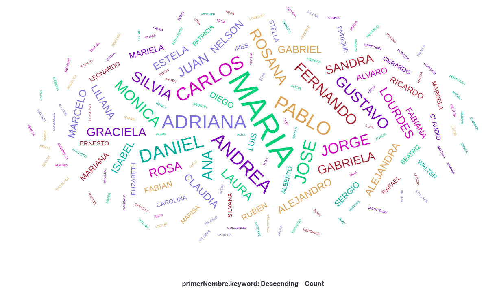

Ejemplo de como se puede obtener muy fácilmente el padrón electoral completo de Uruguay.

En Twitter: https://twitter.com/andresantoniuk/status/1145325508474916869

Abro hilo sobre  privacidad y protección de datos.
Veamos como terceros con buena o mala voluntad, cobrando o haciéndolo gratis acceden fácilmente a todo el padrón electoral de Uruguay.

Primero un ejemplo con buena intención: https://twitter.com/UniversidadORT/status/1143545806101843968

Luego otro con claro fin de lucro: https://twitter.com/diego_vallarino/status/1144955735798890497

Hasta donde entiendo, ninguno de los dos ejemplos anteriores cumple con las obligaciones de la Ley de Protección de Datos Personales
https://www.gub.uy/unidad-reguladora-control-datos-personales/politicas-y-gestion/obligaciones

Sin ser experto en "Data Science" dediqué un rato de sábado lluvioso y es muy fácil obtener el padrón completo.
Ver código en python: https://github.com/andresantoniuk/padron-electoral-uy

Con esto se puede hacer algo divertido e inofensivo como ver la distribución de nombres en uno de los circuitos

Pero imaginen todo lo que se podría hacer teniendo acceso a esta información con más tiempo, recursos y objetivos concretos.

¿que pasaría si en vez del padrón electoral se puede acceder a la história clínica de todos los Uruguayos?
https://twitter.com/apr/status/1133559592267522049

Hay casos concretos donde esto ya pasó:
https://techcrunch.com/2019/06/14/medical-injury-claim-data-exposed/
https://www.cbsnews.com/news/hackers-steal-medical-records-sell-them-on-dark-web/

Acá cruzando el charco, hace poco se expusieron datos muy sensibles
https://twitter.com/mis2centavos/status/1139702908180504576

Entonces: ¿que hacer con todo esto? ¿volvemos al papel?

No, no deberíamos frenar el progreso pero cada vez hay que ser más responsables y conscientes que iniciativas mismo con fines loables tienen riesgos y pueden traer consecuencias negativas.
